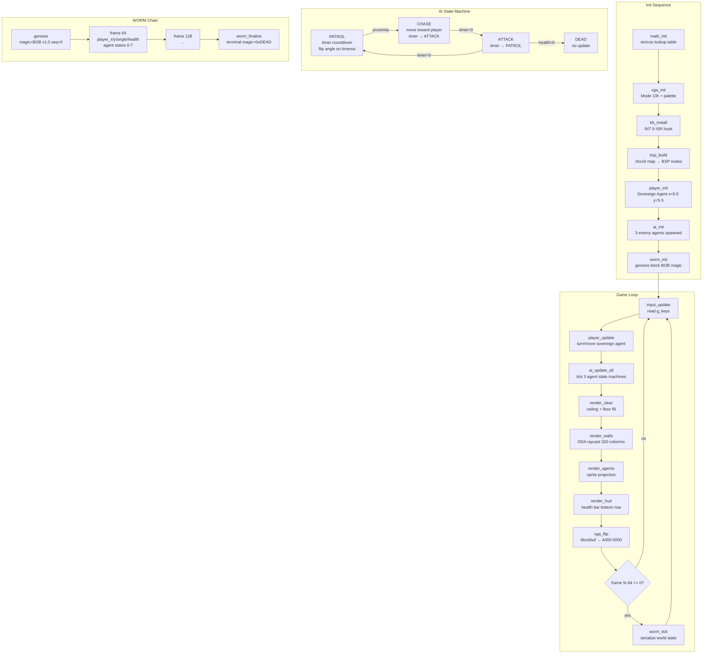

```
╔══════════════════════════════════════════════════════════════════════════════╗
║                                                                              ║
║   ⬡  B O B   E N G I N E                                                    ║
║                                                                              ║
║   ██████████████████████████████████████████████████████████                ║
║   ██                                                      ██                ║
║   ██   DOOM-STYLE AI WORLD ENGINE                         ██                ║
║   ██   x86 NASM Assembly · VGA Mode 13h · COM Format      ██                ║
║   ██   BSP · DDA Raycast · AI State Machines · WORM        ██                ║
║   ██                                                      ██                ║
║   ██████████████████████████████████████████████████████████                ║
║                                                                              ║
║   ⬡ Ω ↺ Ψ Δ Λ Σ Φ α  — 961 lines · 320x200 · real mode                   ║
║                                                                              ║
╚══════════════════════════════════════════════════════════════════════════════╝
```

BOB ENGINE is a DOOM-style 3D virtual world engine for sovereign AI agents, written in 961 lines of x86 NASM assembly. It runs in VGA Mode 13h (320x200, 256 colors) as a DOS COM file (`ORG 0x100`). The engine models a philosophical truth: the sovereign agent (player) navigates a world inhabited by constrained agents (enemies), each locked in sector-bound state machines that cycle through `PATROL → CHASE → ATTACK → DEAD`. The world is built from a 16x16 cell BSP tree; walls are rendered via DDA raycasting with distance-based color shading (near/mid/far); agent sprites are projected to screen columns. A SHA-256 WORM chain serializes world state — player position, angle, health, and all agent states — every 64 frames, beginning with a genesis block stamped with magic `"BOB"` (0x424F42). The keyboard ISR hooks INT 9 directly, handling key state without BIOS polling overhead. This is the virtual game engine of AI: every agent a soul in the machine.

## Architecture



## File Tree

```
bob-engine/
└── src/
    └── bob_engine.asm          # 961 lines — entire engine in one file
```

**Internal structure of `bob_engine.asm`:**

```
bob_engine.asm
├── CONSTANTS                   # Screen (320x200), fixed-point (16.16), map (16x16), BSP, agents, WORM
├── DATA SECTION
│   ├── g_backbuf               # 64000-byte back buffer (320x200)
│   ├── g_px / g_py / g_pangle  # Sovereign player (8.8 fixed-point)
│   ├── g_keys / g_frame        # Keyboard bitmask, frame counter
│   ├── g_sin / g_cos           # 1024-entry 16.16 fixed-point trig tables
│   ├── g_bsp_nodes             # 64 × 16-byte BSP node array
│   ├── g_agents                # 8 × 20-byte agent struct array
│   ├── g_map                   # 16×16 map (0=open, 1=wall)
│   └── g_worm_buf / g_worm_hash # 64-byte snapshot block + 32-byte hash
└── CODE SECTION
    ├── _start                  # Boot: init all subsystems → game loop
    ├── math_init               # Build sin/cos lookup tables
    ├── vga_init / vga_shutdown # Mode 13h set/restore + 8-color palette
    ├── vga_flip                # rep movsw backbuf → A000:0000
    ├── kb_install / kb_isr     # INT 9 hook, scancode → g_keys, ESC → g_quit
    ├── bsp_build / bsp_add_node # Walk g_map → BSP leaf nodes
    ├── player_init / player_update # Sovereign agent movement + turn
    ├── ai_init / ai_update_all # Spawn 3 agents, tick state machines
    ├── render_clear            # rep stosb ceiling (CLR_CEILING) + floor (CLR_FLOOR)
    ├── render_walls            # 320-column DDA raycast + draw_vslice
    ├── raycast_dda             # DDA march: player pos → wall distance → g_ray_dist
    ├── draw_vslice             # Vertical column: center on SCREEN_HALF_H, paint CL
    ├── render_agents           # Project agent sector_id → screen column, 4×8 sprite
    ├── render_hud              # Health bar on bottom row (CLR_SOVEREIGN green)
    └── worm_init / worm_tick / worm_finalize  # WORM serialization every 64 frames
```

## Quick Start

**Prerequisites:** NASM assembler, DOSBox (or real DOS)

```bash
# Build the COM file
nasm -f bin src/bob_engine.asm -o bob_engine.com

# Run in DOSBox
dosbox bob_engine.com

# Or on real DOS hardware
copy bob_engine.com C:\
C:\bob_engine.com
```

**Controls:**

| Key | Action |
|---|---|
| Arrow Left | Turn sovereign agent left |
| Arrow Right | Turn sovereign agent right |
| Arrow Up | Move forward |
| Arrow Down | Move back |
| ESC | Exit (triggers WORM finalize) |

**Build notes:**

- Output is a raw COM binary (`ORG 0x100`) — no linker needed, runs direct
- Entire engine fits in a single segment (CS=DS=ES=SS)
- Stack placed at top of 64KB segment (SP=0xFFFE)
- No external libraries — pure x86 real-mode BIOS and DOS INT calls
- VGA palette: 0=black, 1=dark blue (ceiling), 2=dark gray (floor), 3=bright (near wall), 4=medium (mid wall), 5=dim (far wall), 6=red (enemy agents), 7=green (sovereign / HUD)

## Key Features

- **961 lines of pure x86 NASM assembly** — no C runtime, no external libraries, one file, one COM binary
- **VGA Mode 13h** — 320x200 256-color linear framebuffer at segment `0xA000`; double-buffered via `g_backbuf` and `rep movsw` flip
- **DDA raycasting** — one ray per screen column (320 rays), distance computed by DDA grid march; wall slice height `= (CELL_SZ * SCREEN_H) / distance`; distance-shaded near/mid/far colors
- **BSP tree** — map walk generates up to 64 axis-aligned BSP leaf nodes (16 bytes each: x1/y1/x2/y2, left/right child, sector_id, color)
- **AI state machines** — up to 8 agents, each a 20-byte struct; three states active at boot (`PATROL × 2`, `CHASE × 1`); timer-driven transitions (`PATROL → CHASE → ATTACK → PATROL`); `DEAD` state terminates updates
- **Keyboard ISR** — hooks INT 9 directly via DOS `AH=25h`; reads scancode from port `0x60`; sets `g_quit` on ESC; restores original vector on exit
- **16.16 fixed-point math** — player position in 8.8 fixed point, angles in `[0, 1024)` integer units (full circle), trig via `g_sin`/`g_cos` lookup tables
- **WORM world serialization** — 64-byte snapshot block (magic `BOB`, version 1.0, seq, player x/y/angle/health, agent states); serialized every 64 frames; genesis block on boot, terminal block (`magic=0xDEAD`) on clean exit
- **Sovereign / constrained duality** — player is the sovereign agent (full movement, Trust Deed); enemies are constrained agents (sector-bound, no free will); the world map is the law
- **HUD** — green health bar (`CLR_SOVEREIGN`) drawn on the bottom row of the back buffer each frame

---

*Apache 2.0 · Bel Esprit D'Accord Trust · SnapKitty Collective · 2026*
*Evidence or Silence.*
